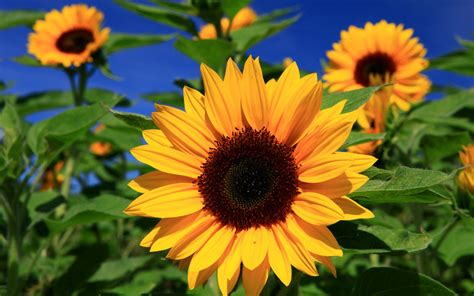
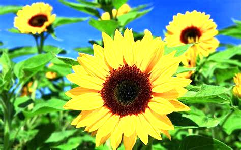
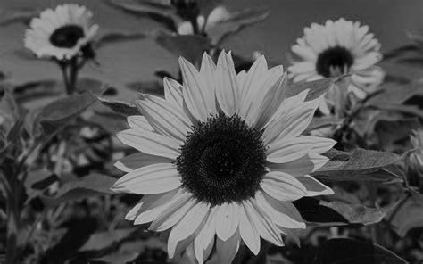

# imageEditor 
> [imageEditor](https://github.com/2k4sm/code/tree/main/JavaProjects/imageditor) Command line tool written in java to do simple image edits from the comfort of your terminal.
# Usage
> Usage: imageEditor.java \<command> [inputimage] [outputImageName]\
>--Possible commands: mirrorImage,rotateImage,convertToGrayScale,brightnessControl,monochromeImage 

# CLI 
- The cli is made by using simple if-else statements which check for any user error and guides the user to interact with the tool properly.
- The tool uses the args array to take the user inputs which are the image file and the output image name.
- The tool uses \<command> to process the image file.

# Working 
- The tool uses File to create input and output File objects and then uses them to create a BufferedImage object.
- Then it uses switch-case to triggers the user required function which handles the processing of the image and creates a BufferedImage object which then is converted back to an image file with the provided Outputimage name.
- Upon Successful Completion of the operation It prints a success message to the terminal.Otherwise if any error occurs it prints it to the terminal.

# Functions

- *__Original Image__*

1. *__mirrorImage__*
    - This swaps the position of the opposite pixels from the  inputImage BufferedImage and puts it in the outputImage BufferedImage.
    - Then it returns the created BufferedImage.

    
2. *__rotateImage__*
    - This function first transposes the original image and creates a transposed output image by swapping the column with the row.
    - Then the transposed image is mirrored with the created mirrorImage function.
    - Then it returns created BufferedImage. 

    
3. *__convertToGrayScale__*
    - This function takes the value of each pixel from the inputImage BufferedImage and then Puts it in a OutputImage BufferedImage which has the recieve type for only gray. So it only accepts the gray values into it and discards the remaining values.
    - Then it returns the created BufferedImage.

    
4. *__brightnessControl__*
    - This takes an userInput(can be positive/can be negative) which is the brightness percentage.
    - This first gets the color information of each pixel and stores in a color Object.
    - Then each of the color is individually increased/decreased by the brightness percentage till the color value is not beyond 255.
    - If any of the color is getting beyond 255 then it sets the color value to 255.
    - Then all the changed color values are used to create a int value.
    - This value is used to set in the new outputImage object.
    - Then the created BufferedImage is returned.

    
5. *__monochromeImage__*
    - This Takes each input pixel then creates a color object to get its color information and then creates a new color object with each red,green,blue(rgb) assigned to the avarage of the three.
    - Then it returns the outputImage BufferImage.

    

## These are all the Functions that have been implemented to make this command line tool.

# By : Shrinibas Mahanta.

